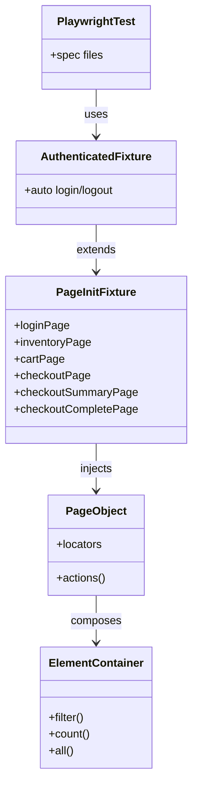

# Tulip

Playwright test automation framework for Sauce Demo, built with strict TypeScript, ESLint, and Page Object Model patterns.

## Installation

```bash
git clone <repository-url>
cd tulip
npm ci
npx playwright install --with-deps
cp .env.example .env
```

Update `.env` with the test credentials:

```env
TEST_USERNAME=<username>
TEST_PASSWORD=<password>
```

`BASE_URL`, browser mode, slow motion, and worker count can also be overridden in `.env`.

## Usage

Run the static quality gates:

```bash
npm run check
```

Run the Playwright tests:

```bash
npm test
```

Run a single browser:

```bash
npx playwright test --project=desktop-chromium
```

Open the HTML report:

```bash
npm run show-report
```

## Architecture

The framework uses fixture-based dependency injection with Page Objects.
`page-init.fixture.ts` provides reusable page instances, while
`authenticated.fixture.ts` adds automatic login/logout for authenticated flows.
Tests stay focused on business assertions, and UI interaction details live in
Page Objects and reusable element containers.



## Project structure

```text
src/
├── config/                  # Enums, credentials, env loader, shared config
├── fixture/                 # Playwright fixtures and dependency injection
├── services/                # API/state services for setup and assertions
├── page-objects/            # Page Objects and element containers
│   └── element-containers/  # Reusable widget containers
└── tests/                   # Playwright specs and setup tests
.github/                     # Workflows, instructions, and local agent assets
playwright.config.ts         # Playwright runner configuration
eslint.config.mjs            # ESLint flat config
tsconfig.json                # Strict TypeScript configuration
.env.example                 # Environment template
```

## Scripts

| Command | Description |
| --- | --- |
| `npm run typecheck` | TypeScript strict type check |
| `npm run lint` | ESLint validation |
| `npm run lint:fix` | Auto-fix lint issues |
| `npm run check` | Typecheck + lint |
| `npm run mcp:playwright` | Start the repository-pinned Playwright MCP server |
| `npm run pretest` | Enforce `check` before test execution |
| `npm run check:all` | Typecheck + lint + Playwright tests |
| `npm run ci` | Full local CI gate (`check:all`) |
| `npm test` | Run Playwright tests |
| `npm run show-report` | Open Playwright HTML report |

## Engineering governance docs

The repository uses a split single-source-of-truth model:

- `CODING_STANDARDS.md` — coding/test automation standards (TypeScript + Playwright)
- `AGENTS.md` — workflow/process/approval policy
- `PROJECT.md` — project-specific values (paths, commands, branch defaults)
- `.github/agents/AGENT_SHARED_CONTRACT.md` — shared agent contract and load order

## Agent system

Project agents are defined in `.github/agents/*.agent.md` and reusable skills in
`.github/skills/*/SKILL.md`.

- Agents orchestrate planning, generation, healing, review, git/PR flow, and tracker workflow.
- Skills provide focused implementation playbooks (locators, assertions, fixtures, POs, etc.).
- Agent handoffs use ignored files under `.agent-artifacts/`; production code never depends on them.
- `.github/copilot-instructions.md` contains the agent and skill routing tables.

## Playwright MCP (required for local diagnostics)

For MCP-required scenarios (defined in `AGENTS.md`), local agent runs should use Playwright MCP and
produce the MCP evidence template from `PROJECT.md`.

Install prerequisites:

```bash
npm install
npx playwright install
```

Playwright MCP server command:

```bash
npm run mcp:playwright
```

Project-level MCP config (checked in):

- `.mcp.json` starts the pinned Playwright MCP package through the npm script.

Tracker access uses host-managed Atlassian tools when available, an organization-approved Jira MCP
configured in the host, or the REST fallback variables documented in `PROJECT.md`. The repository
does not install an unmaintained tracker MCP package.

### VS Code setup

1. Use an MCP-capable Copilot/agent extension build.
2. Load/import the project-level `.mcp.json` in your MCP settings (workspace scope).
3. Reload VS Code and run an agent task that calls Playwright tools (for example snapshot/navigate).

### WebStorm setup

1. Open **Settings** → **Tools** → **AI Assistant / MCP** (name may vary by version).
2. Load/import the project-level `.mcp.json`.
3. Save, restart the IDE if needed, then run an agent task that uses Playwright tools.

### CI note

CI does not need to start an MCP server. For MCP-required scenarios, CI uses artifact-based
equivalent evidence (`test-results/junit.xml`, `playwright-report/`, retry traces), as defined in
`PROJECT.md`.

## Reusing the agent team

For a new or existing Playwright project, copy the control plane:

```text
AGENTS.md
CODING_STANDARDS.md
PROJECT.md
.github/copilot-instructions.md
.github/agents/
.github/skills/
```

Then update every project-specific value in `PROJECT.md`. For the complete runnable baseline, also
adopt `.mcp.json`, `.env.example`, the npm/TypeScript/ESLint/Playwright configuration, and the CI
workflow. Run:

```bash
npm ci
npx playwright install --with-deps
npm run check
```

The `project-scaffolding` skill contains portable templates for the base element container, test
tags, fixture entrypoint, and Page Object. Existing projects map their current structure in
`PROJECT.md`; they do not need to reorganize solely for the agent team.

## Parallel agents and competing fixes

Writing agents run in separate git worktrees and branches, with separate artifact/report paths,
ports, credentials, and test-data namespaces. The lead may run independent scenarios or alternative
fix hypotheses in parallel up to the limit in `PROJECT.md`.

Every competing fix must run the same reproduction, focused tests, stability repetitions, and
quality gates. The lead selects one result by correctness, determinism, maintainability, and scope;
candidates are never merged automatically.

## Updating the agent system

1. Change canonical policy only in its owning SoT document.
2. Update `PROJECT.md` when a project value or runtime integration changes.
3. Keep agent files role-specific and skills procedural; do not copy canonical rules into them.
4. Update pinned tool packages deliberately through `package.json` and `package-lock.json`.
5. Run `npm run check`.

## Notes

- Use absolute imports with the `@/` alias.
- Store sensitive user data in `.env` and never commit it.
- Use `.env.example` as the template for required variables.
- Follow the repository coding standards in `CODING_STANDARDS.md`.
- Keep project-specific agent settings (paths, commands, branches) in `PROJECT.md`.
